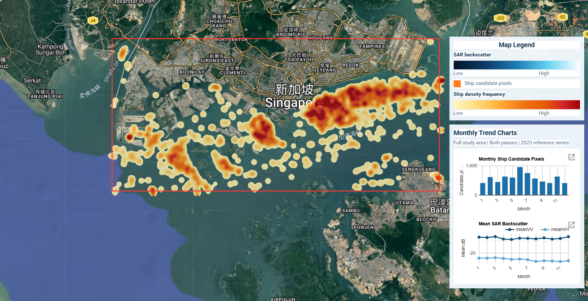
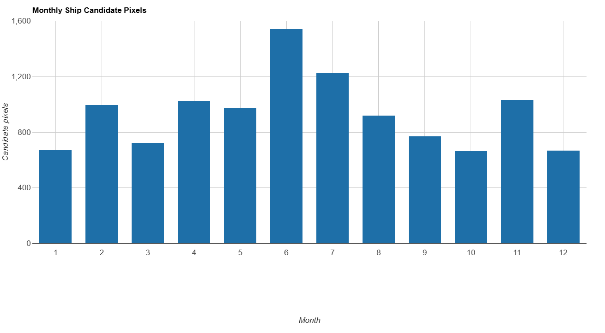
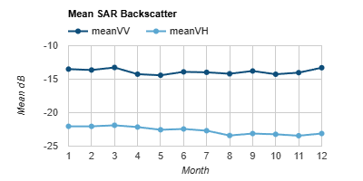
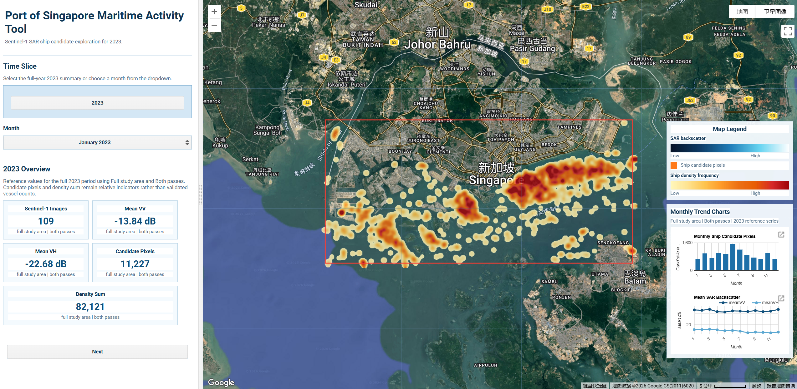
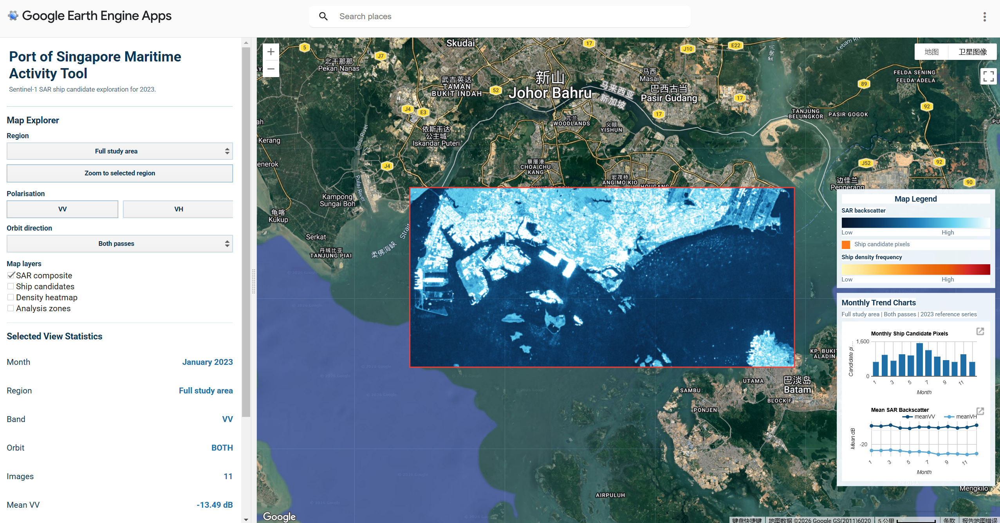

# Interactive Analysis of Maritime Activity in the Port of Singapore Using Sentinel-1

## Project Summary

### Problem Statement

This project addresses the challenge of understanding maritime activity patterns in the Port of Singapore using remotely sensed data. As one of the busiest port regions in the world, Singapore experiences dense ship traffic and complex spatial use across port zones, anchorage areas, and shipping lanes. Our application aims to provide an interactive way to explore these spatial patterns using satellite radar imagery.

### End User

This application is designed for students, researchers, and users interested in maritime monitoring and spatial analysis. It helps users explore how satellite imagery can reveal activity patterns in port environments and supports better understanding of how maritime space is used in a globally significant shipping hub.

### Data

The project uses Sentinel-1 GRD data from Google Earth Engine [@gee_s1_grd]. Sentinel-1 is a Synthetic Aperture Radar (SAR) dataset that provides day-and-night, all-weather observations. For this project, the imagery was filtered to the Port of Singapore and surrounding waters for the 2023 calendar year. Only images acquired in IW mode and containing both VV and VH polarisations were retained.

The final image collection contains **109 Sentinel-1 images**, including **61 ascending** and **48 descending** orbit passes. Monthly image counts were calculated to confirm temporal data availability, showing relatively stable coverage across the year.

| Data filtering criterion | Selection used in this project |
|---|---|
| Dataset | Sentinel-1 SAR GRD [@gee_s1_grd] |
| Platform | Google Earth Engine |
| Study period | 2023-01-01 to 2023-12-31 |
| Study area | Port of Singapore and surrounding waters |
| Instrument mode | IW |
| Polarisation bands | VV and VH |
| Total images | 109 |
| Ascending passes | 61 |
| Descending passes | 48 |
| Temporal check | Monthly image counts used to confirm data availability |


Figure: Monthly Sentinel-1 image count in the study area for 2023.

### Why Sentinel-1?

Sentinel-1 was selected because SAR imagery is particularly suitable for maritime monitoring. Unlike optical imagery, it is unaffected by cloud cover and lighting conditions, making it well suited to busy coastal and port environments [@esa_sentinel1; @gee_s1_grd]. The VV polarisation channel is sensitive to surface roughness and large metallic structures such as ship hulls, while VH captures volume scattering and can help distinguish between vessel types and background clutter.

### Limitations

Although Sentinel-1 is useful for maritime analysis, it also has some limitations:

- Radar imagery is affected by speckle noise, which can reduce the clarity of individual features
- Interpretation is less intuitive than optical imagery and requires domain knowledge
- Orbit direction and viewing geometry may affect backscatter comparability across passes
- Near-shore areas produce complex mixed signals due to land-water boundary effects
- Ship detection in this project remains approximate and has not been validated against AIS or manually labelled vessel data
- Connected-pixel and size filtering reduce some false positives, but near-shore clutter and strong non-ship reflections may still affect detection quality

---

## Methodology

### Overview

The project follows a five-stage processing pipeline: data filtering and collection, speckle filtering, water and land masking, ship candidate detection, and interface-based analytical visualisation. Each stage is implemented in Google Earth Engine using JavaScript and is documented in the project repository for reproducibility.

### Stage 1: Data Filtering and Collection

The study area (AOI) was defined as a rectangular polygon covering the Port of Singapore and surrounding waters (longitude 103.60°E to 104.05°E, latitude 1.15°N to 1.36°N). Sentinel-1 GRD imagery was filtered by this AOI, the 2023 calendar year, IW instrument mode, and the presence of both VV and VH polarisation bands. This produced a collection of 109 images suitable for analysis.

A median composite image was generated as the baseline output for each time period. The median operator was selected over mean compositing because it is more robust to outliers such as transient bright targets or atmospheric artefacts.

<details>
<summary>Show code</summary>

```javascript
var YEAR = 2023;

var aoi = ee.Geometry.Polygon(
  [[[103.60, 1.15],
    [104.05, 1.15],
    [104.05, 1.36],
    [103.60, 1.36],
    [103.60, 1.15]]]
);

var s1 = ee.ImageCollection('COPERNICUS/S1_GRD')
  .filterBounds(aoi)
  .filterDate('2023-01-01', '2024-01-01')
  .filter(ee.Filter.eq('instrumentMode', 'IW'))
  .filter(ee.Filter.listContains('transmitterReceiverPolarisation', 'VV'))
  .filter(ee.Filter.listContains('transmitterReceiverPolarisation', 'VH'));

function getMonthStart(monthNumber) {
  return ee.Date.fromYMD(YEAR, monthNumber, 1);
}

function getMonthEnd(monthNumber) {
  return getMonthStart(monthNumber).advance(1, 'month');
}

function getMonthlyCollection(monthNumber) {
  return filterByOrbit(
    s1.filterDate(getMonthStart(monthNumber), getMonthEnd(monthNumber))
  );
}

function makeMonthlyComposite(collection) {
  return ee.Image(ee.Algorithms.If(
    collection.size().gt(0),
    collection.median().clip(aoi),
    emptySarImage()
  ));
}
```

</details>

### Stage 2: Speckle Filtering

SAR imagery inherently contains speckle noise — a granular, salt-and-pepper texture caused by the coherent nature of radar signals. If left untreated, speckle can produce false positives in vessel detection and reduce the visual interpretability of the imagery.

A **3×3 focal mean filter** was applied to each image in the collection before compositing. This smooths local pixel variation while preserving the general spatial structure of maritime features such as ship wakes and port infrastructure. The filtered output was compared against the raw composite to verify noise reduction without excessive blurring.

<details>
<summary>Show code</summary>

```javascript
function preprocessForDetection(image) {
  image = ee.Image(image);

  var vv = image.select('VV')
    .focal_mean({
      radius: 1,
      kernelType: 'square',
      units: 'pixels'
    })
    .rename('VV_filtered');

  var vh = image.select('VH')
    .focal_mean({
      radius: 1,
      kernelType: 'square',
      units: 'pixels'
    })
    .rename('VH_filtered');

  return vv.addBands(vh)
    .updateMask(waterMask)
    .updateMask(openWaterMask)
    .copyProperties(image, ['system:time_start', 'orbitProperties_pass']);
}
```

</details>

### Stage 3: Water and Land Masking

To focus analysis on open water and suppress land-related backscatter, two masking steps were applied:

**Water mask:** The JRC Global Surface Water dataset (occurrence layer) was used to identify pixels with greater than 50% historical water occurrence [@gee_jrc_gsw; @pekel2016surface]. Only these pixels were retained for further analysis, effectively removing land and built-up areas from the image.

**Near-shore buffer:** Coastal and near-shore areas produce complex mixed signals where land and water backscatter overlap, leading to high rates of false vessel detections. A 500-metre exclusion buffer was applied around all land boundaries using the USDOS LSIB simplified coastline dataset [@gee_lsib_simple]. Pixels within this buffer zone were removed from the clean output layer.

<details>
<summary>Show code</summary>

```javascript
var waterOccurrence = ee.Image('JRC/GSW1_4/GlobalSurfaceWater')
  .select('occurrence');

var waterMask = waterOccurrence.gt(50);

var land = ee.FeatureCollection('USDOS/LSIB_SIMPLE/2017')
  .filterBounds(aoi);

var landImage = ee.Image(0).byte().paint(land, 1);

var coastalBuffer = landImage.focal_max({
  radius: 500,
  kernelType: 'circle',
  units: 'meters'
});

var openWaterMask = coastalBuffer.eq(0);
```

</details>

### Stage 4: Ship Candidate Detection

After preprocessing, ship candidates were extracted from the clean VV backscatter layer using a threshold-based detection approach. Pixels with VV backscatter above a selected threshold were first identified as bright targets. To reduce random noise and non-ship artefacts, connected-pixel filtering was then applied. Very small isolated detections were removed using a minimum connected-pixel threshold, while overly large bright objects were excluded using a maximum connected-pixel threshold.

Several parameter combinations were tested to evaluate the stability of the detection results, including threshold values (**-12, -10, -8**), minimum connected pixels (**1, 2, 3**), and maximum connected pixels (**10, 15, 25**). Across the selected Singapore test scene, the main offshore ship targets remained relatively stable under these parameter ranges, suggesting that the main detections were driven by consistent high-backscatter targets rather than isolated random noise.

A final parameter set of **threshold = -10**, **minPixels = 2**, and **maxPixels = 15** was selected as a balanced configuration. This setting preserved the major offshore targets while reducing some near-shore false positives. The output of this stage is a **ship candidate detection mask**, which forms the analytical basis for the following visualisation and interpretation steps.

<details>
<summary>Show code</summary>

```javascript
var DETECTION_THRESHOLD = -10;
var DETECTION_MIN_PIXELS = 2;
var DETECTION_MAX_PIXELS = 15;

function detectShipsFromCleanImage(cleanImage) {
  cleanImage = ee.Image(cleanImage);

  var brightTargets = cleanImage.select('VV_filtered')
    .gt(DETECTION_THRESHOLD);

  var connected = brightTargets.connectedPixelCount(100, true);

  var filtered = brightTargets
    .updateMask(connected.gte(DETECTION_MIN_PIXELS))
    .updateMask(connected.lte(DETECTION_MAX_PIXELS));

  return filtered.selfMask().rename('ship');
}

function makeDetectionMask(collection) {
  var cleanCollection = collection.map(preprocessForDetection);

  var cleanComposite = ee.Image(ee.Algorithms.If(
    collection.size().gt(0),
    cleanCollection.median().clip(aoi),
    emptyCleanImage()
  ));

  return detectShipsFromCleanImage(cleanComposite);
}
```

</details>


Figure: Final ship candidate detection result using threshold = -10, minPixels = 2, and maxPixels = 15.

---

## Advanced Analysis

### Spatial Density Heatmap

The ship candidate detection result from Stage 4 is used as the basis for a spatial density analysis of maritime activity. Rather than introducing a separate detection method, this stage transforms the VV-based ship candidate output into a more interpretable user-facing layer for identifying recurring activity zones.

For each Sentinel-1 image, the detected ship candidate pixels are converted into a binary layer, where candidate pixels are assigned a value of 1 and non-candidate pixels are assigned a value of 0. These binary layers are then summed across the selected image collection to create a ship density heatmap. Areas with higher heatmap values represent locations where ship candidates are detected more frequently, making it easier to identify recurring maritime activity zones such as anchorage areas, shipping lanes, and busy port waters.

<details>
<summary>Show code</summary>

```javascript
function detectShipBinary(image) {
  image = ee.Image(image);

  var vv = image.select('VV')
    .focal_mean({
      radius: 1,
      kernelType: 'square',
      units: 'pixels'
    });

  var brightTargets = vv.gt(DETECTION_THRESHOLD);
  var connected = brightTargets.connectedPixelCount(100, true);

  var shipMask = brightTargets
    .updateMask(connected.gte(DETECTION_MIN_PIXELS))
    .updateMask(connected.lte(DETECTION_MAX_PIXELS));

  return shipMask
    .unmask(0)
    .updateMask(waterMask)
    .updateMask(openWaterMask)
    .unmask(0)
    .rename('ship')
    .copyProperties(image, ['system:time_start', 'orbitProperties_pass']);
}

function makeHeatmap(collection) {
  var heatmap = ee.Image(ee.Algorithms.If(
    collection.size().gt(0),
    collection.map(detectShipBinary).select('ship').sum().clip(aoi),
    emptySingleBandImage('ship')
  ));

  return heatmap.rename('ship');
}

function makeHeatmapDisplay(heatmap) {
  heatmap = ee.Image(heatmap);

  var smoothed = heatmap
    .focal_max({
      radius: HEATMAP_RADIUS_PEAK_METRES,
      kernelType: 'circle',
      units: 'meters'
    })
    .focal_mean({
      radius: HEATMAP_RADIUS_SPREAD_METRES,
      kernelType: 'circle',
      units: 'meters'
    })
    .focal_mean({
      radius: HEATMAP_RADIUS_BLEND_METRES,
      kernelType: 'circle',
      units: 'meters'
    })
    .multiply(HEATMAP_VIS_BOOST);

  return smoothed
    .updateMask(smoothed.gt(HEATMAP_VIS_MIN))
    .rename('ship');
}
```

</details>



Figure: Ship density heatmap showing areas with more frequent candidate detections.

### Temporal Exploration and Analytical Outputs

The application also supports monthly exploration of maritime activity. Sentinel-1 images are filtered by month, and the same ship candidate detection output is summarised to calculate monthly ship candidate pixel totals for 2023. These totals are displayed as a column chart, allowing users to compare relative activity levels across months. The chart is linked to the map interface, so selecting a month updates the displayed monthly SAR composite and associated ship activity layers.

<details>
<summary>Show code</summary>

```javascript
function computeMonthlyStatsForCharts(monthNumber, callback) {
  var monthCollection = s1.filterDate(
    getMonthStart(monthNumber),
    getMonthEnd(monthNumber)
  );

  var monthComposite = makeMonthlyComposite(monthCollection);
  var monthDetection = makeDetectionMask(monthCollection);
  var monthHeatmap = makeHeatmap(monthCollection);

  var meanBackscatter = monthComposite.select(['VV', 'VH']).reduceRegion({
    reducer: ee.Reducer.mean(),
    geometry: aoi,
    scale: 100,
    maxPixels: 1e8,
    tileScale: 4
  });

  var shipPixels = monthDetection.unmask(0).reduceRegion({
    reducer: ee.Reducer.sum(),
    geometry: aoi,
    scale: 30,
    maxPixels: 1e8,
    tileScale: 4
  }).get('ship');

  var densitySum = monthHeatmap.unmask(0).reduceRegion({
    reducer: ee.Reducer.sum(),
    geometry: aoi,
    scale: 60,
    maxPixels: 1e8,
    tileScale: 4
  }).get('ship');

  ee.Dictionary({
    month: monthNumber,
    label: getMonthShortName(monthNumber),
    images: monthCollection.size(),
    meanVV: meanBackscatter.get('VV'),
    meanVH: meanBackscatter.get('VH'),
    candidates: shipPixels,
    density: densitySum
  }).evaluate(callback);
}

function updateCharts() {
  var statsFc = chartStatsFeatureCollection();

  var candidateChart = ui.Chart.feature.byFeature(
      statsFc,
      'month',
      ['candidates']
    )
    .setChartType('ColumnChart')
    .setOptions({
      title: 'Monthly Ship Candidate Pixels',
      hAxis: {title: 'Month'},
      vAxis: {title: 'Candidate pixels'},
      legend: {position: 'none'}
    });

  var backscatterChart = ui.Chart.feature.byFeature(
      statsFc,
      'month',
      ['meanVV', 'meanVH']
    )
    .setChartType('LineChart')
    .setOptions({
      title: 'Mean SAR Backscatter',
      hAxis: {title: 'Month'},
      vAxis: {title: 'Mean dB'},
      legend: {position: 'top'}
    });

  chartsContainer.add(candidateChart);
  chartsContainer.add(backscatterChart);
}
```

</details>

:::: {.columns}

::: {.column width="50%"}


Figure: Monthly ship candidate pixel totals in 2023.
:::

::: {.column width="50%"}


Figure: Monthly mean Sentinel-1 VV and VH backscatter trends in 2023.
:::

::::

---

## Interface

The interactive application provides the following features for exploring maritime activity in the Port of Singapore:

:::: {.columns}

::: {.column width="50%"}


Figure: Overview screen before entering the Map Explorer.
:::

::: {.column width="50%"}


Figure: Map Explorer screen after selecting Next.
:::

::::

- **Overview screen and time selector**: Users start with a 2023 overview page showing reference values for the full study area and both orbit passes. They can view the annual summary or choose a specific month before moving into the map explorer.
- **Map Explorer navigation**: The **Next** button opens the main Map Explorer, while the **Back** button returns users to the overview screen.
- **Region controls**: Users can select the full study area or one of four analysis zones: West anchorage, Central harbour, East anchorage, and Southern approach. The dashboard can zoom directly to the selected region.
- **Polarisation controls**: Users can switch between VV and VH backscatter for visual comparison. Detection-based outputs are linked to the VV workflow, so ship candidates and density heatmap layers are only available in VV mode.
- **Orbit direction filter**: Users can compare results from both passes, ascending-only imagery, or descending-only imagery.
- **Map layer toggles**: Users can turn the SAR composite, ship candidate layer, density heatmap, analysis zones, and study area boundary on or off.
- **Ship candidate layer**: In VV mode, candidate ship pixels are displayed as an orange layer using the threshold-based and connected-pixel detection workflow.
- **Density heatmap**: The heatmap shows smoothed concentrations of detected candidate pixels, helping users identify recurring maritime activity zones across port waters.
- **Selected view statistics**: The summary panel updates for the active month, region, band, and orbit setting. It reports image count, mean VV, mean VH, candidate pixels, and density sum.
- **Map legend and monthly charts**: A fixed right-side panel explains SAR backscatter, ship candidate pixels, and density frequency. It also shows monthly reference charts for ship candidate pixels and mean SAR backscatter across 2023.

Ship candidate detection is currently displayed for the VV band only, because the detection workflow is based on filtered VV backscatter rather than VH imagery.

---

## The Application

The interactive application is embedded below. Use the left panel to move from the overview screen into the Map Explorer, then explore maritime activity patterns by month, region, polarisation, orbit direction, and map layer. The right-side legend and monthly charts remain visible on the map to support interpretation during the live demo.

[**Live Application: singapore-port-maritime**](https://week6-gee-coursework.projects.earthengine.app/view/singapore-port-maritime)



### Method and Limitations

Detection uses filtered VV backscatter greater than -10 dB, connected-pixel groups between 2 and 15 pixels, a water mask, and a 500 m near-shore exclusion buffer.

The orange layer shows ship candidates rather than AIS-validated vessels. Strong port infrastructure, near-shore clutter, and fixed thresholds can still create false positives or missed small vessels. Candidate pixels and density sums should therefore be interpreted as relative indicators of maritime activity, not validated vessel counts.

The VH layer is useful for visual comparison of backscatter, but the ship candidate and density heatmap layers are derived from VV. For this reason, the dashboard disables those detection-based layers when VH is selected.

## How it Works

The application combines SAR preprocessing, rule-based ship candidate detection, and interface-based visual exploration to support interpretation of maritime activity in the Port of Singapore. Its design follows a staged workflow in which raw Sentinel-1 imagery is progressively transformed into interactive map layers, summary statistics, and temporal charts.


Figure: Workflow of the application, from Sentinel-1 preprocessing to ship candidate detection and interactive visualisation.

### 1. Preprocessing

The first stage prepares the input imagery. Sentinel-1 GRD scenes are filtered to the 2023 study period and the Port of Singapore study area. Because SAR imagery is affected by speckle noise, a 3×3 focal mean filter is applied to smooth local variation while preserving larger spatial structures. The workflow then uses the JRC Global Surface Water dataset to retain open-water pixels and applies a 500 m near-shore exclusion buffer to reduce mixed land–water backscatter and strong coastal clutter. This preprocessing stage creates a cleaner radar surface for subsequent ship candidate extraction and follows the use of Earth Engine catalogue datasets for Sentinel-1 handling, water masking, and coastal exclusion [@gee_s1_guide; @gee_jrc_gsw; @gee_lsib_simple].

### 2. Ship Candidate Detection

The second stage identifies ship candidates from the filtered VV backscatter layer. Bright radar returns above a selected threshold are interpreted as potential vessel targets. However, thresholding alone produces many isolated noisy detections, so connected-pixel filtering is used to retain only groups of pixels within a defined size range. In the final configuration, detections are derived using a threshold of **-10 dB**, a minimum connected-pixel size of **2**, and a maximum of **15**. This produces a ship candidate mask that highlights likely vessel-related targets while reducing small speckle artefacts and overly large non-ship reflections.

<details>
<summary>Show code</summary>

```javascript
function preprocessForDetection(image) {
  image = ee.Image(image);

  var vv = image.select('VV')
    .focal_mean({
      radius: 1,
      kernelType: 'square',
      units: 'pixels'
    })
    .rename('VV_filtered');

  var vh = image.select('VH')
    .focal_mean({
      radius: 1,
      kernelType: 'square',
      units: 'pixels'
    })
    .rename('VH_filtered');

  return vv.addBands(vh)
    .updateMask(waterMask)
    .updateMask(openWaterMask)
    .copyProperties(image, ['system:time_start', 'orbitProperties_pass']);
}

function detectShipsFromCleanImage(cleanImage) {
  cleanImage = ee.Image(cleanImage);

  var brightTargets = cleanImage.select('VV_filtered')
    .gt(DETECTION_THRESHOLD);

  var connected = brightTargets.connectedPixelCount(100, true);

  var filtered = brightTargets
    .updateMask(connected.gte(DETECTION_MIN_PIXELS))
    .updateMask(connected.lte(DETECTION_MAX_PIXELS));

  return filtered.selfMask().rename('ship');
}

function makeDetectionMask(collection) {
  var cleanCollection = collection.map(preprocessForDetection);

  var cleanComposite = ee.Image(ee.Algorithms.If(
    collection.size().gt(0),
    cleanCollection.median().clip(aoi),
    emptyCleanImage()
  ));

  return detectShipsFromCleanImage(cleanComposite);
}
```

</details>

### 3. App Integration and Visualisation

The third stage integrates the detection output into the interactive Earth Engine application. Users can switch between months, regions, orbit directions, and polarisation bands to compare spatial and temporal patterns. Because the detection workflow is based on filtered VV backscatter, the ship candidate layer and density heatmap are only available in VV mode. Supporting statistics and fixed monthly charts are displayed alongside the map to provide additional context for interpreting relative activity levels across the port.

<details>
<summary>Show code</summary>

```javascript
function updateMapLayers() {
  currentFilteredCollection = getMonthlyCollection(currentMonth);
  currentComposite = makeMonthlyComposite(currentFilteredCollection);
  currentDetectionMask = makeDetectionMask(currentFilteredCollection);
  currentHeatmap = makeHeatmap(currentFilteredCollection);

  var displayHeatmap = makeHeatmapDisplay(currentHeatmap);
  var sarVis = currentBand === 'VV' ? vvVis : vhVis;

  appMap.layers().set(0, ui.Map.Layer(
    currentComposite,
    sarVis,
    'SAR ' + currentBand + ' composite - ' +
      getMonthShortName(currentMonth) + ' ' + YEAR,
    showSarLayer
  ));

  appMap.layers().set(1, ui.Map.Layer(
    displayHeatmap,
    heatmapVis,
    'Monthly ship density heatmap - ' + getMonthShortName(currentMonth),
    showHeatmapLayer && currentBand === 'VV'
  ));

  appMap.layers().set(2, ui.Map.Layer(
    currentDetectionMask,
    detectionVis,
    'Ship candidate detection - ' + getMonthShortName(currentMonth),
    showDetectionLayer && currentBand === 'VV'
  ));

  appMap.layers().set(3, ui.Map.Layer(
    zoneOutline,
    {palette: ['00D1FF'], opacity: 0.8},
    'Analysis zones',
    showZoneLayer
  ));

  updateSelectedRegionLayer();

  appMap.layers().set(5, ui.Map.Layer(
    aoiBorder,
    {palette: ['FF3B30'], opacity: 0.95},
    'Study area boundary',
    true
  ));

  updateLayerVisibility();
}

function updateLayerVisibility() {
  appMap.layers().get(0).setShown(showSarLayer);
  appMap.layers().get(1).setShown(showHeatmapLayer && currentBand === 'VV');
  appMap.layers().get(2).setShown(showDetectionLayer && currentBand === 'VV');
  appMap.layers().get(3).setShown(showZoneLayer);
  appMap.layers().get(4).setShown(showZoneLayer && currentRegion !== 'ALL');
  appMap.layers().get(5).setShown(true);
}
```

</details>

### 4. Interpretation and Limitations

The resulting ship candidate layer should be interpreted as an approximate indicator of maritime activity rather than a validated vessel inventory. It has not been validated against AIS or manually labelled vessel data, and some false positives may still remain in complex near-shore environments. For this reason, the app is designed to support exploratory visual analysis and relative comparison across space and time, rather than exact vessel counting.

---

## References
