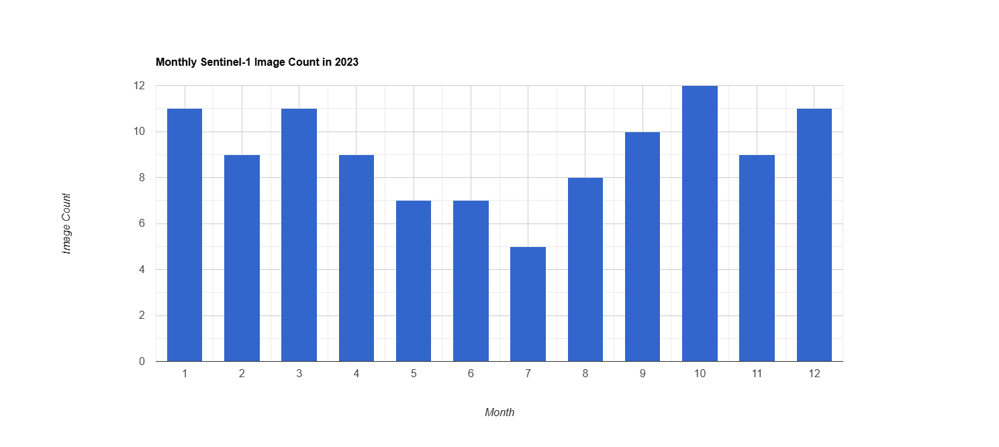
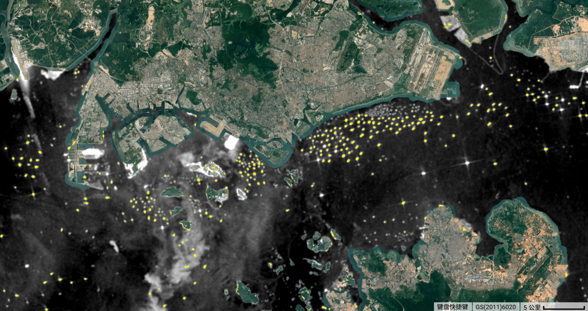
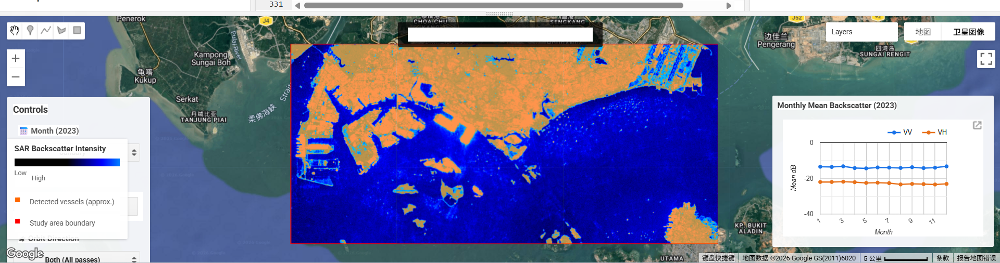
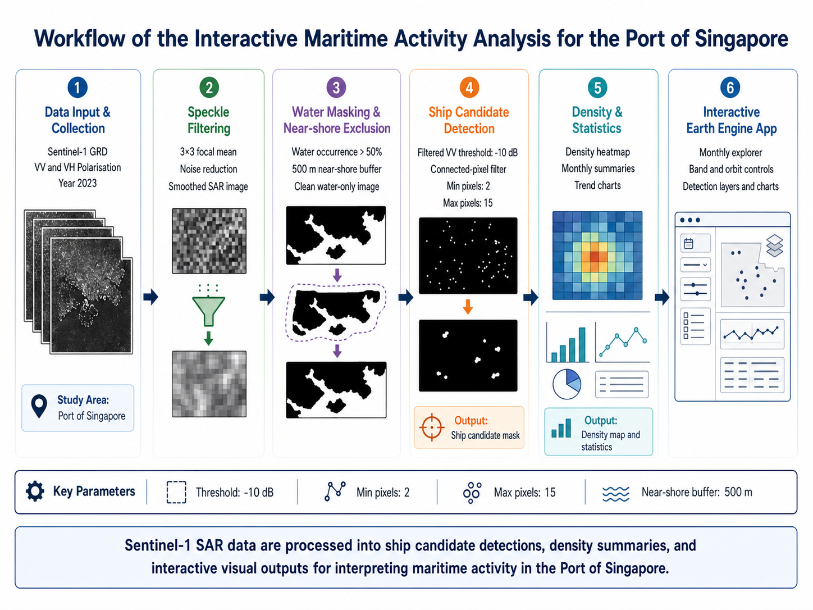

# Interactive Analysis of Maritime Activity in the Port of Singapore Using Sentinel-1

## Project Summary

### Problem Statement

This project addresses the challenge of understanding maritime activity patterns in the Port of Singapore using remotely sensed data. As one of the busiest port regions in the world, Singapore experiences dense ship traffic and complex spatial use across port zones, anchorage areas, and shipping lanes. Our application aims to provide an interactive way to explore these spatial patterns using satellite radar imagery.

### End User

This application is designed for students, researchers, and users interested in maritime monitoring and spatial analysis. It helps users explore how satellite imagery can reveal activity patterns in port environments and supports better understanding of how maritime space is used in a globally significant shipping hub.

### Data

The project uses Sentinel-1 GRD data from Google Earth Engine [@gee_s1_grd]. Sentinel-1 is a Synthetic Aperture Radar (SAR) dataset that provides day-and-night, all-weather observations. We focus on the Port of Singapore and surrounding waters, filtering images from 2023-01-01 to 2023-12-31. The selected images use IW mode and include both VV and VH polarisations.

A total of **109 Sentinel-1 images** were identified for the study area across 2023, comprising 61 ascending and 48 descending orbit passes. Monthly image counts were calculated to confirm temporal data availability, and the results show relatively stable coverage throughout the year.



Figure: Monthly Sentinel-1 image count in the study area for 2023.

### Why Sentinel-1?

Sentinel-1 was selected because SAR imagery is particularly suitable for maritime monitoring. Unlike optical imagery, it is unaffected by cloud cover and lighting conditions, making it well suited to busy coastal and port environments [@esa_sentinel1; @gee_s1_grd]. The VV polarisation channel is sensitive to surface roughness and large metallic structures such as ship hulls, while VH captures volume scattering and can help distinguish between vessel types and background clutter.

### Limitations

Although Sentinel-1 is useful for maritime analysis, it also has some limitations:

- Radar imagery is affected by speckle noise, which can reduce the clarity of individual features
- Interpretation is less intuitive than optical imagery and requires domain knowledge
- Orbit direction and viewing geometry may affect backscatter comparability across passes
- Near-shore areas produce complex mixed signals due to land-water boundary effects
- Ship detection in this project remains approximate and has not been validated against AIS or manually labelled vessel data
- Connected-pixel and size filtering reduce some false positives, but near-shore clutter and strong non-ship reflections may still affect detection quality

---

## Methodology

### Overview

The project follows a five-stage processing pipeline: data filtering and collection, speckle filtering, water and land masking, ship candidate detection, and interface-based analytical visualisation. Each stage is implemented in Google Earth Engine using JavaScript and is documented in the project repository for reproducibility.

### Stage 1: Data Filtering and Collection

The study area (AOI) was defined as a rectangular polygon covering the Port of Singapore and surrounding waters (longitude 103.60°E to 104.05°E, latitude 1.15°N to 1.36°N). Sentinel-1 GRD imagery was filtered by this AOI, the 2023 calendar year, IW instrument mode, and the presence of both VV and VH polarisation bands. This produced a collection of 109 images suitable for analysis.

A median composite image was generated as the baseline output for each time period. The median operator was selected over mean compositing because it is more robust to outliers such as transient bright targets or atmospheric artefacts.

### Stage 2: Speckle Filtering

SAR imagery inherently contains speckle noise — a granular, salt-and-pepper texture caused by the coherent nature of radar signals. If left untreated, speckle can produce false positives in vessel detection and reduce the visual interpretability of the imagery.

A **3×3 focal mean filter** was applied to each image in the collection before compositing. This smooths local pixel variation while preserving the general spatial structure of maritime features such as ship wakes and port infrastructure. The filtered output was compared against the raw composite to verify noise reduction without excessive blurring.

### Stage 3: Water and Land Masking

To focus analysis on open water and suppress land-related backscatter, two masking steps were applied:

**Water mask:** The JRC Global Surface Water dataset (occurrence layer) was used to identify pixels with greater than 50% historical water occurrence [@gee_jrc_gsw; @pekel2016surface]. Only these pixels were retained for further analysis, effectively removing land and built-up areas from the image.

**Near-shore buffer:** Coastal and near-shore areas produce complex mixed signals where land and water backscatter overlap, leading to high rates of false vessel detections. A 500-metre exclusion buffer was applied around all land boundaries using the USDOS LSIB simplified coastline dataset [@gee_lsib_simple]. Pixels within this buffer zone were removed from the clean output layer.

### Stage 4: Ship Candidate Detection

After preprocessing, ship candidates were extracted from the clean VV backscatter layer using a threshold-based detection approach. Pixels with VV backscatter above a selected threshold were first identified as bright targets. To reduce random noise and non-ship artefacts, connected-pixel filtering was then applied. Very small isolated detections were removed using a minimum connected-pixel threshold, while overly large bright objects were excluded using a maximum connected-pixel threshold.

Several parameter combinations were tested to evaluate the stability of the detection results, including threshold values (**-12, -10, -8**), minimum connected pixels (**1, 2, 3**), and maximum connected pixels (**10, 15, 25**). Across the selected Singapore test scene, the main offshore ship targets remained relatively stable under these parameter ranges, suggesting that the main detections were driven by consistent high-backscatter targets rather than isolated random noise.

A final parameter set of **threshold = -10**, **minPixels = 2**, and **maxPixels = 15** was selected as a balanced configuration. This setting preserved the major offshore targets while reducing some near-shore false positives. The output of this stage is a **ship candidate detection mask**, which forms the analytical basis for the following visualisation and interpretation steps.



Figure: Final ship candidate detection result using threshold = -10, minPixels = 2, and maxPixels = 15.

### Stage 5: Interface and Analytical Outputs

The ship candidate detection result from Stage 4 is used as the basis for the interactive application and the subsequent interpretation of maritime activity patterns. Rather than introducing a separate detection method, this stage focuses on transforming the VV-based ship candidate output into more interpretable user-facing layers, summary statistics, and visual analytical tools.

For each Sentinel-1 image, the detected ship candidate pixels are converted into a binary layer, where candidate pixels are assigned a value of 1 and non-candidate pixels are assigned a value of 0. These binary layers are then summed across the selected image collection to create a ship density heatmap. Areas with higher heatmap values represent locations where ship candidates are detected more frequently, making it easier to identify recurring maritime activity zones such as anchorage areas, shipping lanes, and busy port waters.

The application also supports monthly exploration of maritime activity. Sentinel-1 images are filtered by month, and the same ship candidate detection output is summarised to calculate monthly ship candidate pixel totals for 2023. These totals are displayed as a column chart, allowing users to compare relative activity levels across months. The chart is linked to the map interface, so selecting a month updates the displayed monthly SAR composite and associated ship activity layers.

In addition to monthly outputs, the interface includes an optional annual heatmap function. This aggregates ship candidate detections from all 2023 Sentinel-1 images to show full-year detection frequency across the study area. Together, the monthly SAR composites, ship candidate layer, density heatmap, chart-based summaries, and map controls allow users to explore both spatial and temporal patterns of maritime activity in the Port of Singapore.

These outputs should be interpreted as relative indicators of maritime activity rather than validated vessel counts. Since the detections are based on thresholded VV backscatter and have not been validated against AIS or manually labelled ship data, the heatmap and monthly ship pixel totals are most useful for exploratory visual analysis and comparison across space and time.
---

### Interface

The interactive application provides the following features for exploring maritime activity in the Port of Singapore:

- **Overview and month selector**: Users first review the 2023 reference overview, then select any month in 2023 to view the corresponding Sentinel-1 median composite and monthly summary.
- **Map Explorer controls**: Users can select a region, zoom to the selected area, switch between VV and VH polarisation, choose ascending or descending orbit direction, and toggle map layers.
- **Polarisation toggle**: VV and VH support visual comparison of radar backscatter characteristics. Ship candidates and the density heatmap are linked to the VV detection workflow, so those layers are disabled when VH is selected.
- **Ship candidate detection layer**: In VV mode, threshold-based ship candidates are displayed using connected-pixel and size filtering, providing an approximate indicator of maritime activity density.
- **Density heatmap**: A smoothed density layer highlights relative concentrations of candidate detections across the port, making major maritime activity zones easier to interpret than individual points alone.
- **Selected view statistics**: A summary table reports the active month, region, band, orbit direction, image count, mean VV, mean VH, candidate pixels, and density sum.
- **Monthly trend charts**: Fixed reference charts show the 2023 candidate-pixel series and mean SAR backscatter series for the full study area and both passes, supporting quick comparison without repeated chart generation delays.
- **Map legend**: A compact legend explains the SAR backscatter colour ramp, ship candidate layer, and ship density frequency scale.

Ship candidate detection is currently displayed for the VV band only, because the detection workflow is based on filtered VV backscatter rather than VH imagery.



Figure: Screenshot of the interactive application showing monthly Sentinel-1 SAR imagery, the ship candidate detection layer in VV mode, the density heatmap, and the monthly trend charts.

---

## The Application

The interactive application is embedded below. Use the left panel to move from the overview screen into the Map Explorer, then explore maritime activity patterns by month, region, polarisation, orbit direction, and map layer. The right-side legend and monthly charts remain visible on the map to support interpretation during the live demo.

[**Live Application: singapore-port-maritime**](https://week6-gee-coursework.projects.earthengine.app/view/singapore-port-maritime)



### Method and Limitations

Detection uses filtered VV backscatter greater than -10 dB, connected-pixel groups between 2 and 15 pixels, a water mask, and a 500 m near-shore exclusion buffer.

The orange layer shows ship candidates rather than AIS-validated vessels. Strong port infrastructure, near-shore clutter, and fixed thresholds can still create false positives or missed small vessels. Candidate pixels and density sums should therefore be interpreted as relative indicators of maritime activity, not validated vessel counts.

The VH layer is useful for visual comparison of backscatter, but the ship candidate and density heatmap layers are derived from VV. For this reason, the dashboard disables those detection-based layers when VH is selected.

## How it Works

The application combines SAR preprocessing, rule-based ship candidate detection, and interface-based visual exploration to support interpretation of maritime activity in the Port of Singapore. Its design follows a staged workflow in which raw Sentinel-1 imagery is progressively transformed into interactive map layers, summary statistics, and temporal charts.



Figure: Workflow of the application, from Sentinel-1 preprocessing to ship candidate detection and interactive visualisation.

### 1. Preprocessing

The first stage prepares the input imagery. Sentinel-1 GRD scenes are filtered to the 2023 study period and the Port of Singapore study area. Because SAR imagery is affected by speckle noise, a 3×3 focal mean filter is applied to smooth local variation while preserving larger spatial structures. The workflow then uses the JRC Global Surface Water dataset to retain open-water pixels and applies a 500 m near-shore exclusion buffer to reduce mixed land–water backscatter and strong coastal clutter. This preprocessing stage creates a cleaner radar surface for subsequent ship candidate extraction and follows the use of Earth Engine catalogue datasets for Sentinel-1 handling, water masking, and coastal exclusion [@gee_s1_guide; @gee_jrc_gsw; @gee_lsib_simple].

### 2. Ship Candidate Detection

The second stage identifies ship candidates from the filtered VV backscatter layer. Bright radar returns above a selected threshold are interpreted as potential vessel targets. However, thresholding alone produces many isolated noisy detections, so connected-pixel filtering is used to retain only groups of pixels within a defined size range. In the final configuration, detections are derived using a threshold of **-10 dB**, a minimum connected-pixel size of **2**, and a maximum of **15**. This produces a ship candidate mask that highlights likely vessel-related targets while reducing small speckle artefacts and overly large non-ship reflections.

```javascript
function detectShips(image, threshold, minPixels, maxPixels) {
  var brightTargets = image.select('VV_filtered').gt(threshold);
  var connected = brightTargets.connectedPixelCount(100, true);
  var filtered = brightTargets
    .updateMask(connected.gte(minPixels))
    .updateMask(connected.lte(maxPixels));
  return filtered.selfMask();
}

var shipMask = detectShips(detectionComposite, -10, 2, 15);
```

### 3. App Integration and Visualisation

The third stage integrates the detection output into the interactive Earth Engine application. Users can switch between months, regions, orbit directions, and polarisation bands to compare spatial and temporal patterns. Because the detection workflow is based on filtered VV backscatter, the ship candidate layer and density heatmap are only available in VV mode. Supporting statistics and fixed monthly charts are displayed alongside the map to provide additional context for interpreting relative activity levels across the port.

```javascript
function updateMap() {
  var composite = getComposite(currentMonth, currentOrbit);
  Map.layers().set(0, ui.Map.Layer(composite, sarVis, 'SAR Composite'));

  if (currentBand === 'VV') {
    var shipMask = detectShips(composite, -10, 2, 15);
    Map.layers().set(1, ui.Map.Layer(shipMask, {palette: ['FF6600']}, 'Ship Candidates'));
  }
}
```

### 4. Interpretation and Limitations

The resulting ship candidate layer should be interpreted as an approximate indicator of maritime activity rather than a validated vessel inventory. It has not been validated against AIS or manually labelled vessel data, and some false positives may still remain in complex near-shore environments. For this reason, the app is designed to support exploratory visual analysis and relative comparison across space and time, rather than exact vessel counting.


## References
